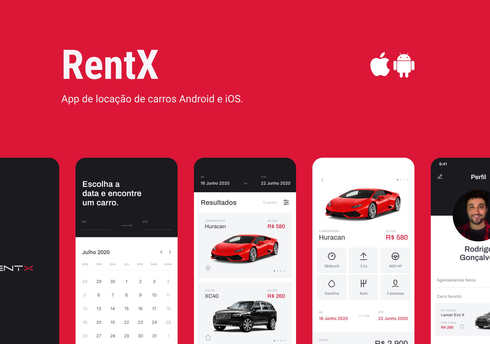

# Rocketseat Ignite React Native RentX

Aplicação completa para aluguel de carros.

## Stack

- React Native
- Typescript
- Expo Bare Workflow
- WatermelonDB
- Lottie
- Reanimated v2
- Cache Image
- Offline first
- Nodejs como backend

## Features

- Autenticação de usuário
- Criação de novo usuário
- Atualização de Perfil
- Lista de carros alugados
- Lista de carros disponíveis
- Aluguel de Carros
- E mais...
